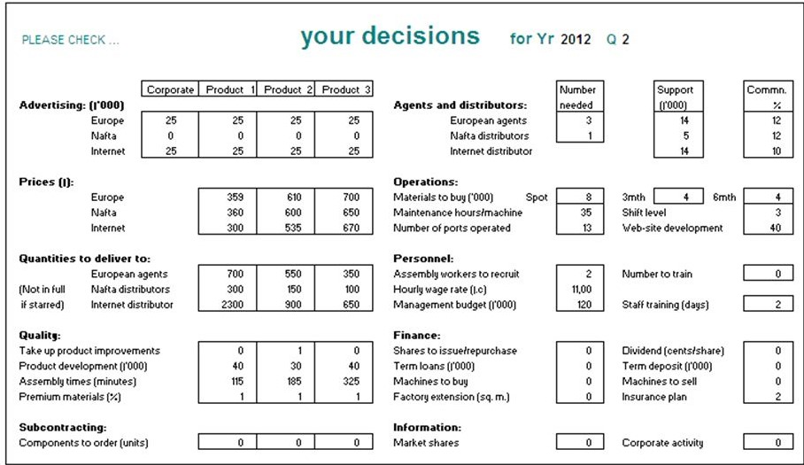
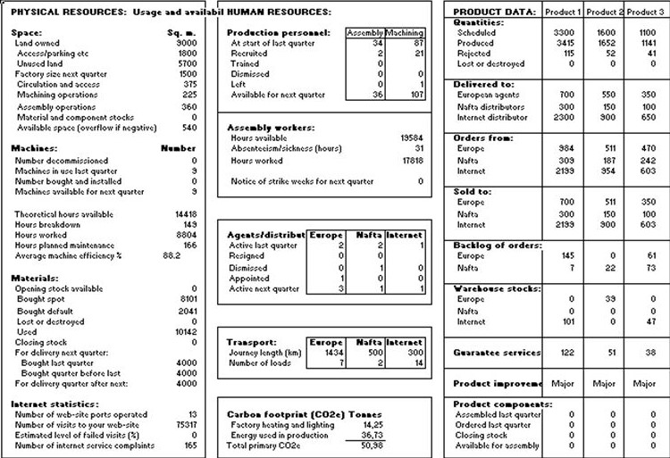
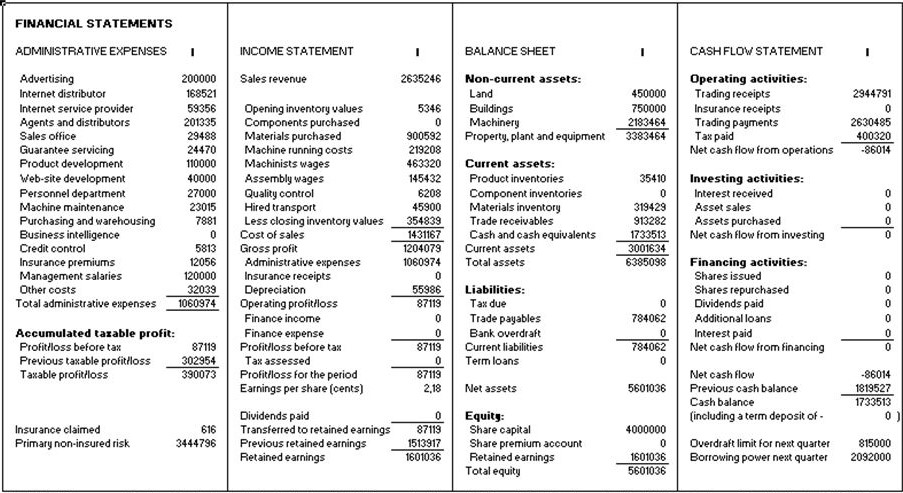
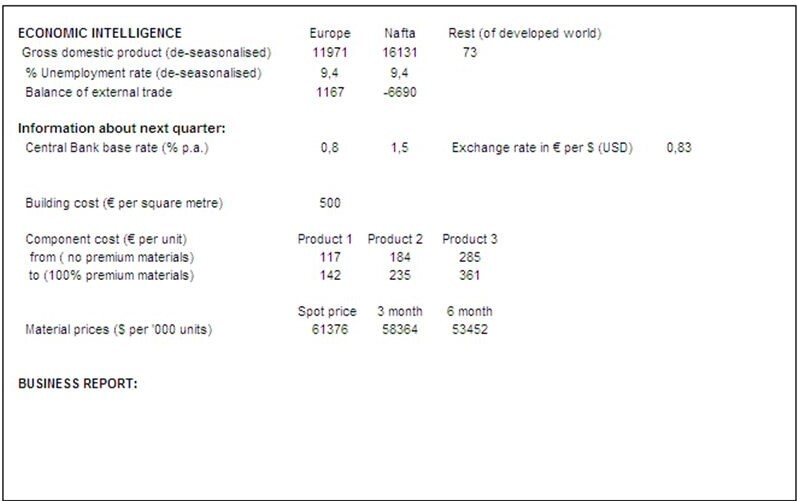
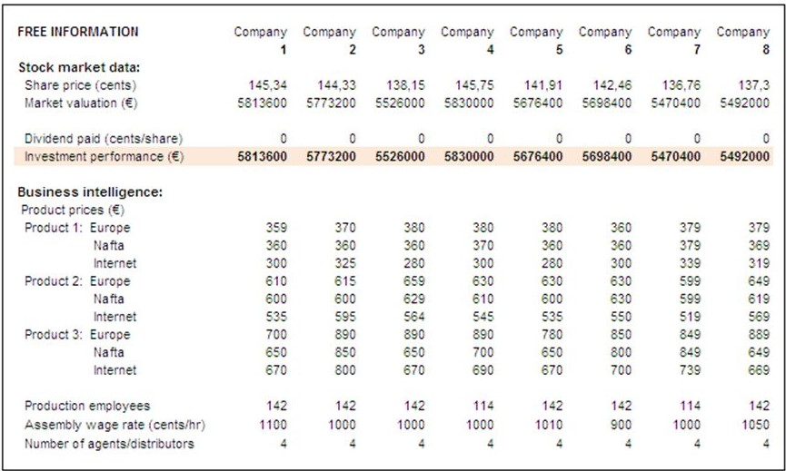
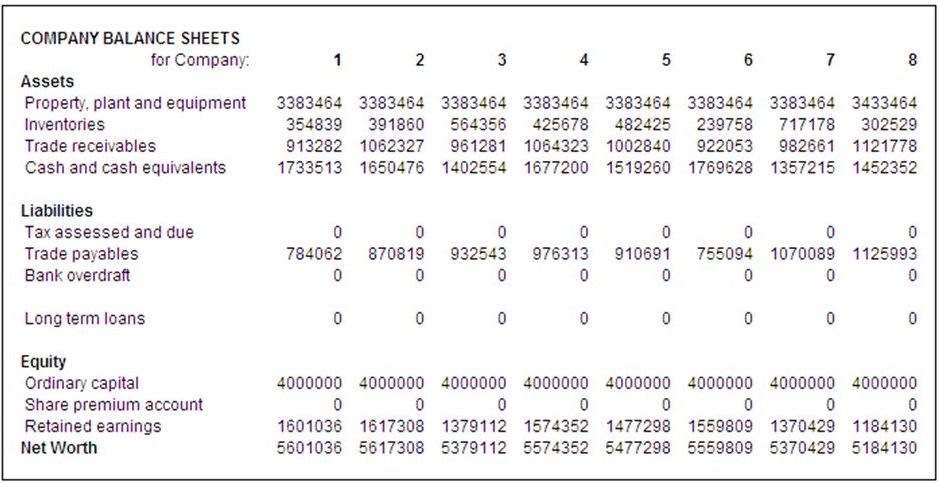
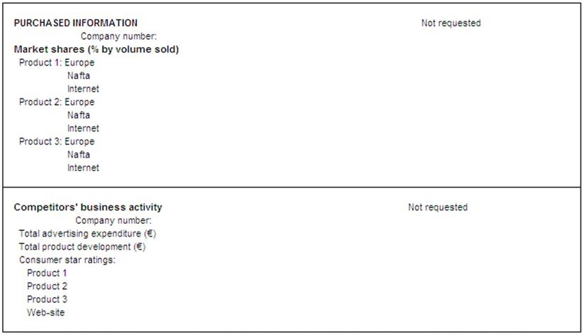

# Forecasting the number of orders
## What is this competition?
Forecasting the number of orders based on the international competition Global Management Challenge. It is a simulation of production company management. It is a simulation of the management of a manufacturing company, in which student and company teams participate. The teams play the role of the company management. The company is listed on the stock exchange. The role of the board is to make decisions based on quarterly reports. The companies operate internationally in three markets:
* European Union
* NAFTA - the United States, Canada and Mexico
* Internet

Teams are divided into up to eight teams. They compete to achieve the highest possible investment result at the end of the simulation. 
Each board makes **75 decisions**, including: production, research and development, sales, recruitment, marketing, investments, credits, dividend payment, issue or purchase of shares. The company produces and sells 3 different products in 3 different markets. 

Each team receives a report:

* Resources and products

 
* The financial statements and

 
* Information about all companies in the group, the market situation and also information requested by the team.

The most important factor is to maximize profit. This is done by selling products. By delivering more products than the customers actually order, we create stocks that we have to store, thus increasing losses, because the products produced by our company do not create added value. Another situation is to produce too few products. Therefore, **the most important thing is to forecast the number of products ordered**.

## Dataset
The data set was created from 257 reports. The reports come from previous editions of my team and from the infected ones. Specific features were selected to build models. They were chosen on the basis of their field knowledge.

## Models and metrics
Linear Regression was used as Baseline model. The models were trained:
* Polynomial Regression
* Random Forest Regression
* Extra Trees Regression
* SVR
* AdaBoost
* XGBoost Regression

Each model was measured using RSE, Max error and MAPE matrices on the training and test set. In addition, the fitting and residuals are presented for evaluation. The model hyperparameters were selected by Bayesian optimization and cross validation.
